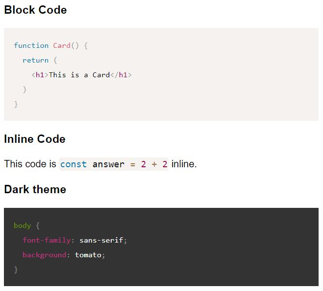

# React Easy Code
<p align="center"> Easy code highlighting in a React component.</p>

<p align="center">
  
</p>

## Features
* batteries-included code highlighting
  * styles
  * tab autoformatting
  * light and dark theme
  * block and inline code
  * jsx, javascript, and css syntax highlighting
* TypeScript ready
* A single component

# Installation
```npm install react-easy-code```

# Usage
```js
import Code from 'react-easy-code';

function App() {
  return (
    <div className="App">
      <h1>Code highlighting is easy!</h1>
      <Code
        render={`
          function Card() {
            return (
              <div className="Card">
                <h1>This is a Card</h1>
              </div>
            )
          }
        `}
      />
    </div>
  )
}
```

# Params
* lang: "jsx" | "javascript" | "css"
* theme: "light" | "dark"
* inline: boolean
* render: string

# Optional
If planning to only use inline code highlighting, you can import the InlineCode component separately:
```js
import Code, { InlineCode, BlockCode } from "react-easy-code";
```